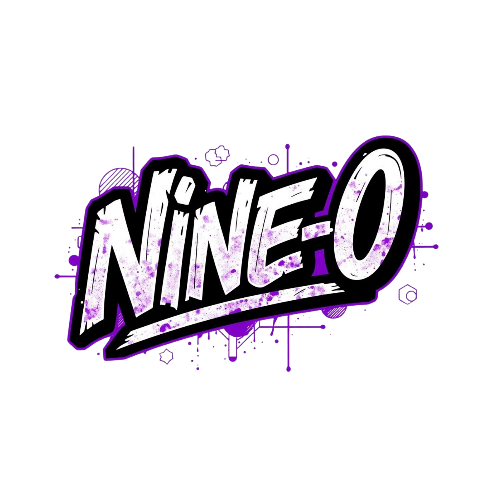
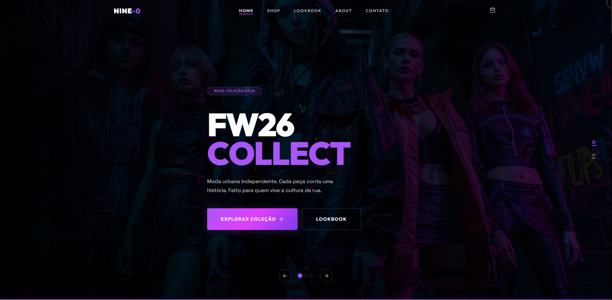
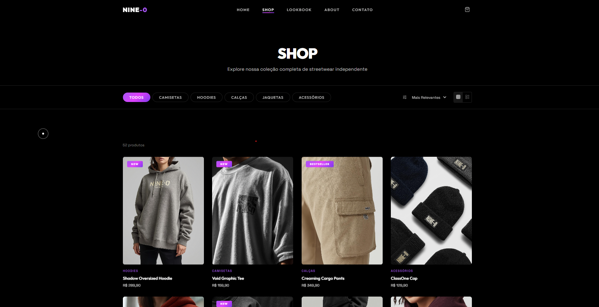
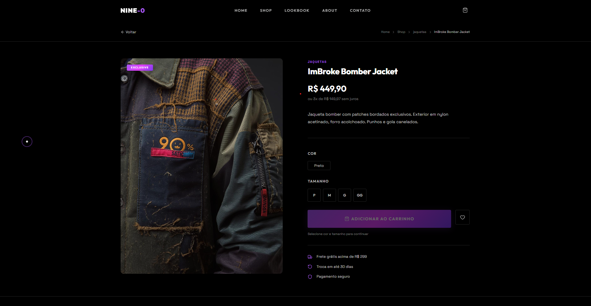

# NINE-0



[](https://reactjs.org/)
[](https://vitejs.dev/)
[](https://nodejs.org/)
[](LICENSE)

Uma plataforma de e-commerce moderna para a marca NINE-0, especializada em streetwear brasileiro autêntico. Construída com React e Vite, oferecendo uma experiência de compra fluida com animações suaves e design responsivo.

## Sumário

- [ Demonstração](#-demonstração)
- [ Funcionalidades](#-funcionalidades)
- [ Tecnologias](#️-tecnologias)
- [ Instalação](#-instalação)
- [ Como Usar](#️-como-usar)
- [ Estrutura do Projeto](#-estrutura-do-projeto)
- [ Contribuição](#-contribuição)
- [ Licença](#-licença)

## Demonstração

### Página Inicial


### Loja


### Detalhes do Produto


##  Funcionalidades

-  **Carrinho de Compras** - Adicione, remova e gerencie itens no carrinho
-  **Busca e Filtros** - Encontre produtos por categoria, nome ou preço
-  **Design Responsivo** - Experiência otimizada para desktop e mobile
-  **Animações Suaves** - Animações GSAP para interações fluidas
-  **Galeria de Produtos** - Visualização detalhada com múltiplas imagens
-  **Lookbook** - Apresentação visual da coleção
-  **Sobre a Marca** - História e valores da NINE-0
-  **Contato** - Formulário de contato integrado

##  Tecnologias

### Frontend
- **React 19** - Biblioteca JavaScript para interfaces
- **Vite** - Build tool e dev server rápido
- **React Router DOM** - Roteamento para SPA
- **GSAP** - Animações de alto desempenho
- **Swiper** - Carrosséis touch-friendly
- **Lucide React** - Ícones modernos

### Desenvolvimento
- **ESLint** - Linting e formatação de código
- **Vite Plugin React** - Integração React com Vite

##  Instalação

### Pré-requisitos
- Node.js 18+
- npm ou yarn

### Passos

1. **Clone o repositório**
   ```bash
   git clone https://github.com/seu-usuario/nine-0.git
   cd nine-0
   ```

2. **Instale as dependências**
   ```bash
   npm install
   ```

3. **Inicie o servidor de desenvolvimento**
   ```bash
   npm run dev
   ```

4. **Abra no navegador**
   ```
   http://localhost:5173
   ```

## Como Usar

### Desenvolvimento
```bash
# Iniciar servidor de desenvolvimento
npm run dev

# Build para produção
npm run build

# Preview do build
npm run preview

# Linting
npm run lint
```

### Navegação
- **/** - Página inicial com destaques
- **/shop** - Loja com todos os produtos
- **/product/:id** - Detalhes do produto específico
- **/about** - Sobre a marca
- **/lookbook** - Galeria visual
- **/contact** - Página de contato

## 📁 Estrutura do Projeto

```
nine-0/
├── public/
│   ├── logo.png
│   ├── camisetas/
│   ├── Hoodies/
│   ├── calças/
│   ├── Acessórios/
│   └── Jaquetas/
├── src/
│   ├── components/
│   │   ├── Navbar.jsx
│   │   ├── ProductCard.jsx
│   │   ├── CartDrawer.jsx
│   │   ├── Footer.jsx
│   │   └── ...
│   ├── pages/
│   │   ├── Home.jsx
│   │   ├── Shop.jsx
│   │   ├── ProductDetail.jsx
│   │   └── ...
│   ├── context/
│   │   └── CartContext.jsx
│   ├── data/
│   │   └── products.js
│   ├── assets/
│   ├── App.jsx
│   └── main.jsx
├── package.json
├── vite.config.js
├── eslint.config.js
└── README.md
```

## Contribuição

Contribuições são bem-vindas! Siga estes passos:

1. Fork o projeto
2. Crie uma branch para sua feature (`git checkout -b feature/AmazingFeature`)
3. Commit suas mudanças (`git commit -m 'Add some AmazingFeature'`)
4. Push para a branch (`git push origin feature/AmazingFeature`)
5. Abra um Pull Request

### Diretrizes
- Mantenha o código limpo e bem documentado
- Siga as convenções de nomenclatura existentes
- Teste suas mudanças antes de submeter

## 📄 Licença

Este projeto está sob a licença MIT. Veja o arquivo [LICENSE](LICENSE) para mais detalhes.

---

**NINE-0** - Streetwear brasileiro autêntico. Feito para quem vive a cultura urbana.
